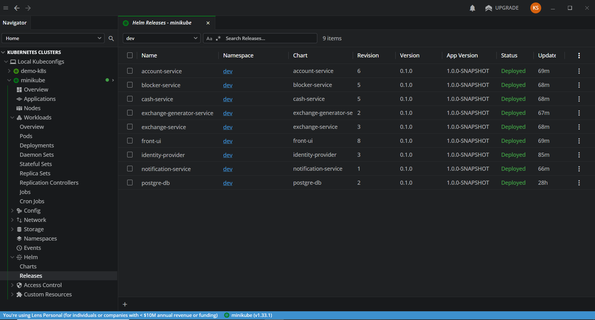
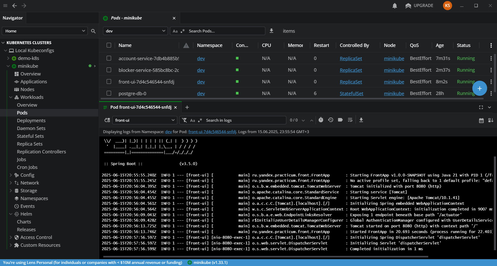
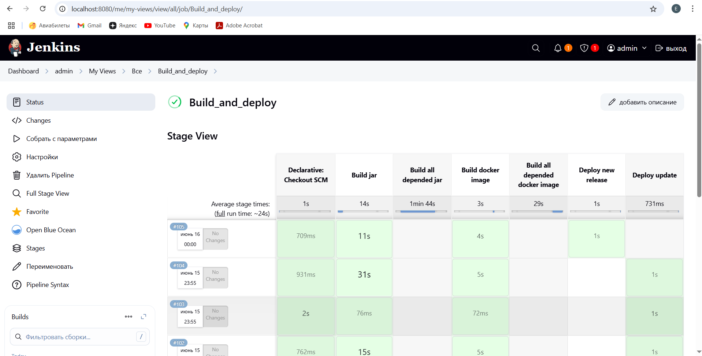
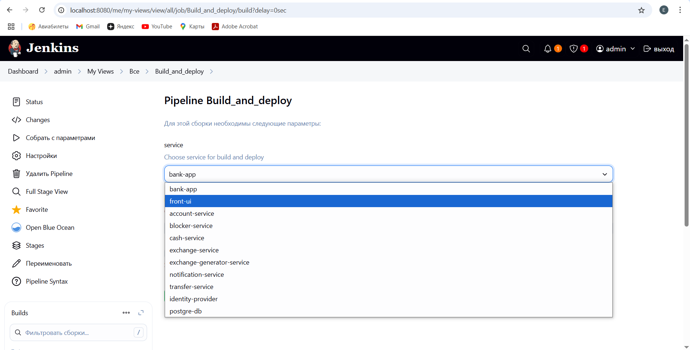
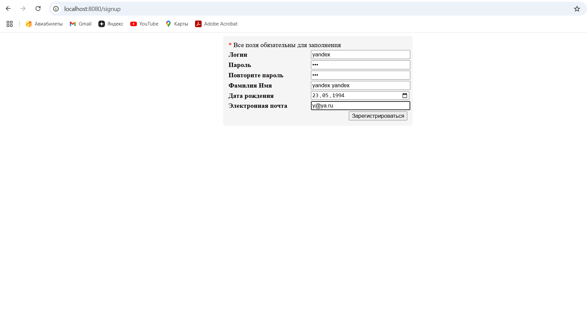
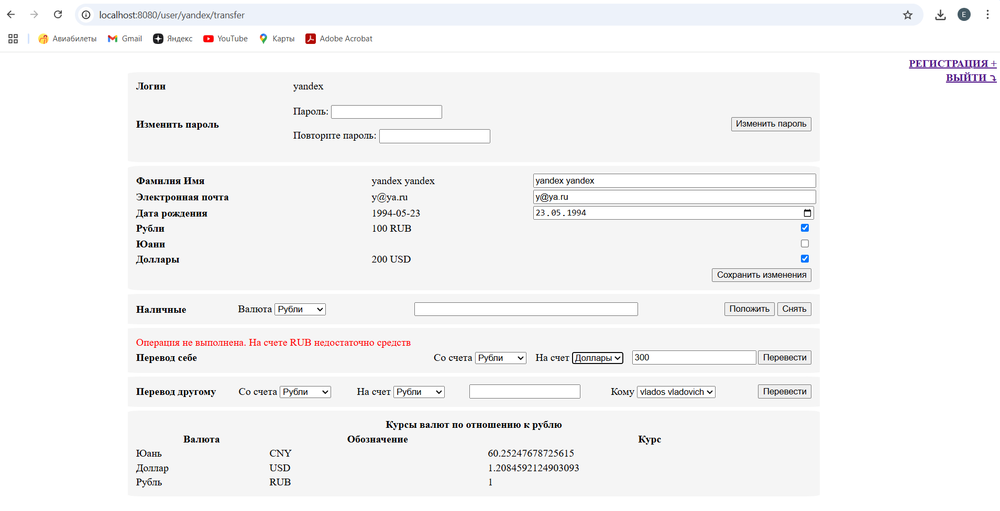

# Микросервисное приложение "Банк"

# Описание
## Структура
Приложение состоит из 9 микросервисов:
- front-ui - фронтальное приложение. Представляет готовые html страницы в браузере, взаимодействует со всеми остальными приложениями по REST
- account-service - мастер-система для данных по пользователям и их счетам. Взаимодействует с СУБД postgresql
- transfer-service - сервис, отвечающих за процесс перевода денег между счетами. Осуществляет оркестрирующую фунцкию
- cash-service - сервис, отвечающих за съем / начисление наличных денег. Осуществялет окрестрирующую функцию
- blocker-service - сервис, разрешающий операции на основе рандомного сравнения значения
- notification-service - сервис, выполняющих отправку уведомлению на электронную почту
- exchange-service - сервис, хранящий информацию о текущем курсе валют и выполняющий их преобразования
- exchange-generator-service - сервис, создающий рандомные значения для текущих курсов валют

## Вспомогательные системы
- Keycloack - identity-провайдер
- Postgresql - СУБД

# Подготовка 
## K8S
Приложение готово к развертыванию в k8s. В качестве локальной реализации предлагам использовать minikube.   
Если у Вас уже готов кластер k8s, то необходимо подготовить наши namespace:
1. kubectl create namespace dev
2. kubectl create namespace test
3. kubectl create namespace prod

Деплой в k8s будет осуществляться при помощи helm-чартов, которые расположены в директории extra/helm.   
Каждый микросервис определен отдельным чартом, но все они объединены под общим зонтичным чартом микросервисного приложения "bank-app".   




Для автоматизации процесса сборки, тестирования и установки рекомендуется использовать Jenkins. Готовый Jenkinsfile лежит в корне репозитория.




## Импорт realm в keycloack
1. Выполните тунелирование на pod keycloack: minikube service identity-provider-svc --url -n dev
2. Перейти по адресу из результата тунелирования
3. Авторизоваться с данными admin / admin
4. Внизу слева выбрать "Realm settings"
5. Выбрать вверху справа выпадающих список и там "Partial import"
6. Выбрать файл ./extra/realm-export.json
7. Указать галочки по всем пунктам
8. Для конфликтов выбрать "Skip"

Готово! Реалм загружен. Теперь нам необходимо для каждого сервиса, выполняющего клиентские запросы, указать его credentials в secret.yaml в соответствующем чарте. 
- Имя сервиса и имя Client в keycloack совпадают. Вам необходимо открыть Client, взять его Credentials -> client secret и указать его в ./extra/helm/bank-app/charts/service-name/templates/secret.yaml в параметре spring.security.client.registration.*.client-secret
- Список сервисов: cash-service, exchange-generator-service, front-ui, transfer-service

## Работа с отправкой уведомлений
Если вы хотите, чтобы сервис notification-service отправил письмо на электронную почту с уведомлением по операции, то необходимо выполнить подготовку:
1. Добавляем данные по почтовому ящику, пользователю и паролю, от имени которых будет идти отправка
2. Заходим в ./extra/helm/bank-app/charts/notification-service/
3. Подготавливаем данные вида 
```yaml
spring:
  mail:
    username: test
    password: test
```
4. Кодируем в Base64
5. Добавляем в secret.yaml

# Использование приложения
Главная страница приложения доступна по адресу http://localhost:8080   
При первом подключении вы будете направлены на страница http://localhost:8080/signin для ввода логина и пароля   
Не авторизованному пользователю также доступна страница http://localhost:8080/signup для регистрации   
Основная логика расположена на странице http://localhost:8080/main , где в отдельных блоках расположены фунцкии сервиса   

# Немного скриншотов


