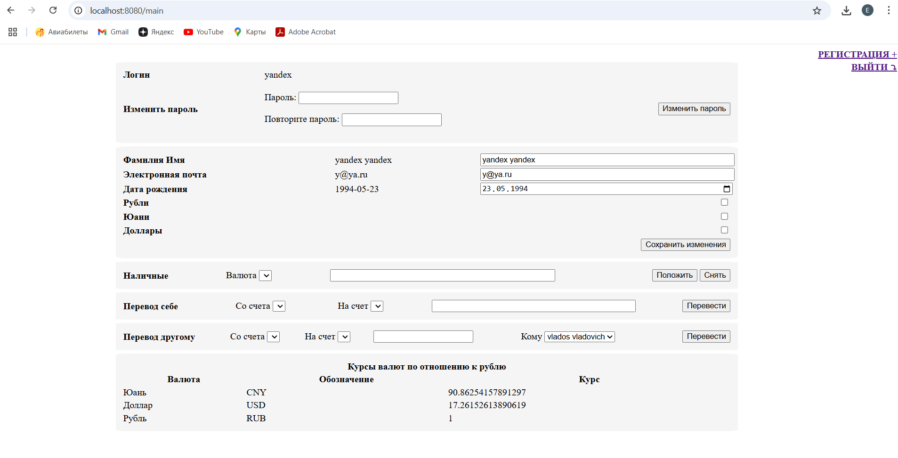

# Микросервисное приложение "Банк"

# Описание
## Структура
Приложение состоит из 9 микросервисов:
- gateway-service - сервис, реализующий Gateway API паттерн, позволяющий убрать из сервисов необходимость обладать информацией об актуальном адресе каждого микросервиса
- front-ui - фронтальное приложение. Представляет готовые html страницы в браузере, взаимодействует со всеми остальными приложениями по REST
- account-service - мастер-система для данных по пользователям и их счетам. Взаимодействует с СУБД postgresql
- transfer-service - сервис, отвечающих за процесс перевода денег между счетами. Осуществляет оркестрирующую фунцкию
- cash-service - сервис, отвечающих за съем / начисление наличных денег. Осуществялет окрестрирующую функцию
- blocker-service - сервис, разрешающий операции на основе рандомного сравнения значения
- notification-service - сервис, выполняющих отправку уведомлению на электронную почту
- exchange-service - сервис, хранящий информацию о текущем курсе валют и выполняющий их преобразования
- exchange-generator-service - сервис, создающий рандомные значения для текущих курсов валют

## Вспомогательные системы
- HashiCorp Consul - система распределенного хранения конфигураций
- Keycloack - identity-провайдер
- Postgresql - СУБД

# Подготовка 
Для удобства запуска все сервисы готовы к запуску с использованием docker-compose   
Для этого перейдите в директорию extra и выполните скрипт run.sh   
В рамках работы скрипта будет выполнена полная сборка всех микросервисов, затем будет запущена БД и keycloack. После этого скрипт встанет на паузу, чтобы вы могли выполнить импорт realm в keycloack
## Импорт realm в keycloack
1. Зайти на адрес http://localhost:9090
2. Авторизоваться с данными admin / admin
3. Внизу слева выбрать "Realm settings"
4. Выбрать вверху справа выпадающих список и там "Partial import"
5. Выбрать файл ./extra/realm-export.json
6. Указать галочки по всем пунктам
7. Для конфликтов выбрать "Skip"

Готово! Реалм загружен. Теперь нам необходимо для каждого сервиса, выполняющего клиентские запросы, указать его credentials в параметрах (application.yaml)
- Имя сервиса и имя Client в keycloack совпадают. Вам необходимо открыть Client, взять его Credentials -> client secret и указать его в ./extra/startup-config/service-name/application.yaml в параметре spring.security.client.registration.*.client-secret
- Список сервисов: cash-service, exchange-generator-service, front-ui, transfer-service

После этого можно в консоли, где запущен скрипт, нажать "Enter"

## Работа с отправкой уведомлений
Если вы хотите, чтобы сервис notification-service отправил письмо на электронную почту с уведомлением по операции, то необходимо выполнить подготовку:
1. Добавляем данные по почтовому ящику, пользователю и паролю, от имени которых будет идти отправка
2. Заходим в ./extra/consul/bootstrap/values.json
3. Для объекта с key config/notification-service/notification/mail/tech-mail-box указываем почтовый ящик, с которого будет идти отправка (например gmail). Кодируем значение в base64
4. Для объекта с key config/notification-service/spring/mail/username указываем имя пользователя. Кодируем значение в base64
5. Для объекта с key config/notification-service/spring/mail/password указываем пароль. Кодируем значение в base64

# Использование приложения
Главная страница приложения доступна по адресу http://localhost:8080   
При первом подключении вы будете направлены на страница http://localhost:8080/signin для ввода логина и пароля   
Не авторизованному пользователю также доступна страница http://localhost:8080/signup для регистрации   
Основная логика расположена на странице http://localhost:8080/main , где в отдельных блоках расположены фунцкии сервиса   

# Немного скриншотов

